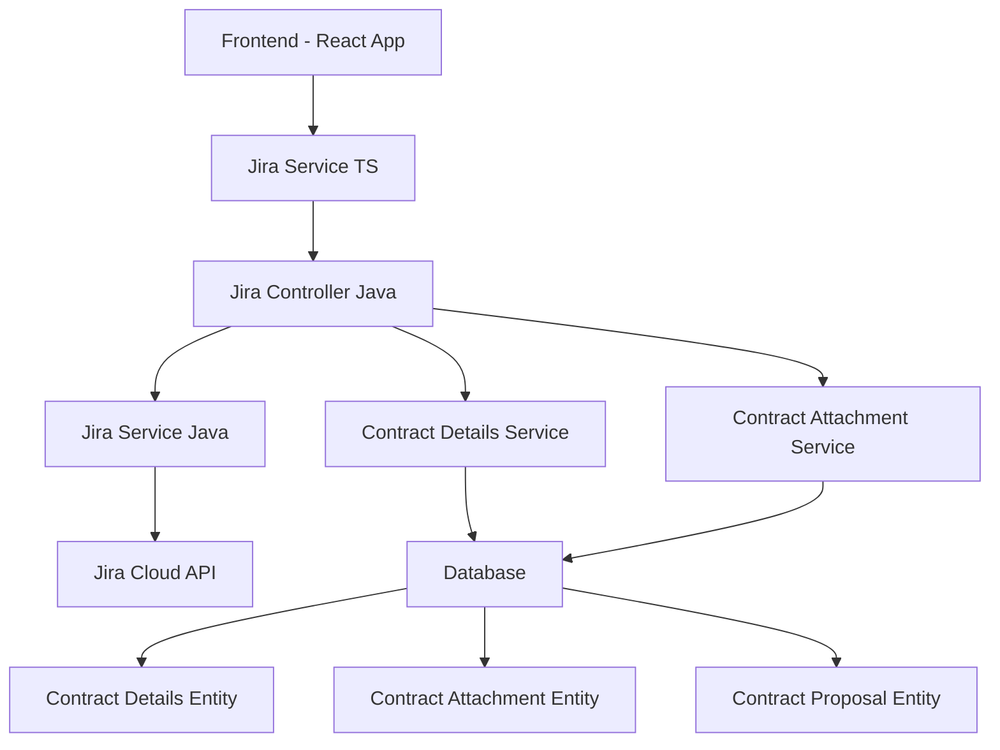
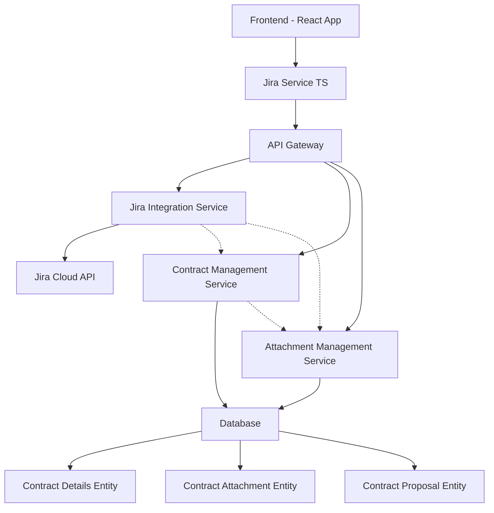
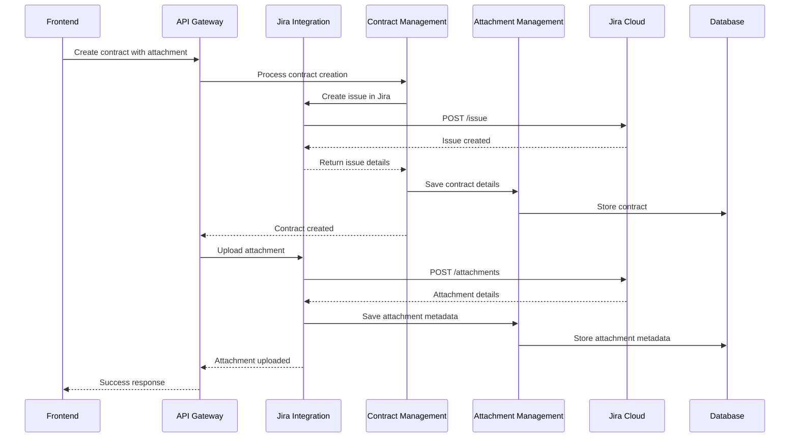
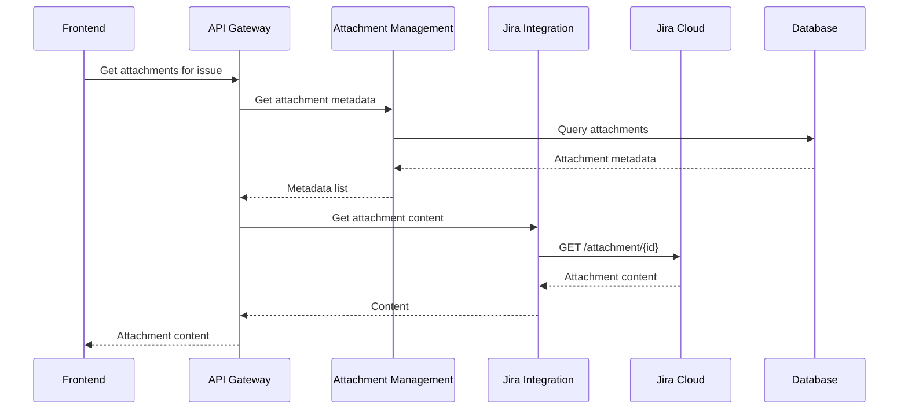

# System Architecture Diagrams

## Current Architecture

## Proposed Segregated Architecture

## Service Boundaries

### Jira Integration Service
- Responsible for all direct communication with Jira Cloud API
- No business logic, only API translation
- Methods:
  - `getIssueByKey()`
  - `createIssue()`
  - `updateIssue()`
  - `addAttachment()`
  - `getAttachments()`
  - `transitionIssue()`

### Contract Management Service
- Handles all contract business logic
- Coordinates with Jira Integration Service for external calls
- Manages contract lifecycle
- Methods:
  - `createContract()`
  - `updateContract()`
  - `getContracts()`
  - `validateContract()`

### Attachment Management Service
- Manages attachment metadata storage
- Coordinates with Jira Integration Service for uploads
- Links attachments to contracts/proposals
- Methods:
  - `saveAttachmentMetadata()`
  - `getAttachmentMetadata()`
  - `linkAttachmentToContract()`
  - `linkAttachmentToProposal()`

## Data Flow Examples

### Creating a Contract with Attachment

### Retrieving Attachments

